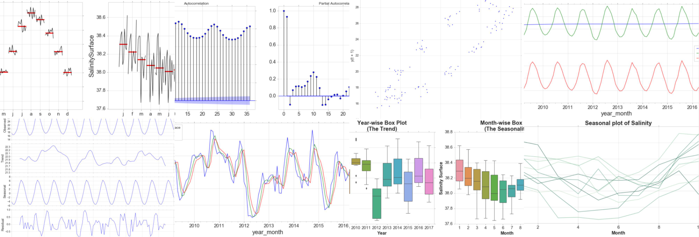

# Time Series Analysis Course

## Course Description

This course is designed to provide a comprehensive introduction to most time series analysis needed as a data science practitioner.  It is designed to be less theoretical, but instead highly practical as most if not all of the techniques learned are highly applicable in real world situations.  For example, the python preparation and visualization techniques learned in this course can be applied by the student to messy time series he/she is likely to encounter in industry.  Additionally, the automated forecasting and cloud deployment material prepares the student to quickly train & deploy baseline models in a commercial production environment.  The deep learning and classification subjects provide some State Of The Art (SOTA) techniques that are used by both top researchers & competitive startups.  Juptyer notebooks form the core learning tool throughout the course and are used as both instructional and assignment vehicles.  

## Key Topics

* TimeSeries Characteristics
* Data Wrangling & Preparation for Time Series Analysis
* Data Visualization
* Time Series Decomposition
* Smoothing Methods
* Regression For Univariate & Multivariate Forecasting
* Manual Machine Learning Forecasting 
* Automated Machine Learning Forecasting
* Azure Model Deployment & Production Architectures for Time Series Model
* Deep Learning Techniques for Univariate & Multivariate Time Series 
* Prophet Technique
* Time Series Classification

## Course Objectives

1. Describe the types of time series analysis and processing and their applications
2. Prepare raw, messy data into format suitable for time series analysis
3. Visualize time series to gain deeper understanding of trends and patterns
4. Decompose time series in fundamental trends, seasonal, and noise components
5. Apply smoothing and regression techniques to forecast future values for time series
6. Apply machine learning techniques to forecast future values for time series
7. Build deep learning neural networks to forecast future values for time series
8. Leverage Azure’s AutoML methods to forecast time series
9. Deploy time series models on Azure Workspace
10. Classify time series using state of the art methods and preparation techniques.

# Repo Struture

* **[weeks](./weeks)**: Contains the lessons plans, homework, and solution for EACH week
* **[data](./data)**: Contains all the necessary CSVs, XLSXs, and other data files necessary for the weeky notebooks
* **[repos](./repos)**: External repos that supplement this course content.
