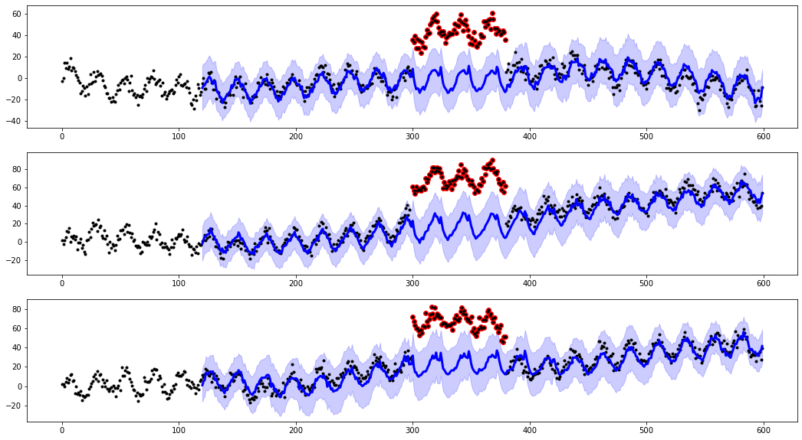

# Week 3 `Practitioner Packages`

This week we'll focus on various time series packages that help a data science practioner more easily apply models, algorithms, transformation to time series.

As a practitioner, it's important to know what the latest/helper packages are being used in the industry in order to make you more efficient as a data scientist.  This week, we'll look at 3 of those packages while also looking at some side topics related to time series such as unevenly spaces timestamps as well as anomaly detection 

1. **[Darts](https://github.com/unit8co/darts)**: Easy manipulation and forecasting of time series
2. **[Slices](https://github.com/datascopeanalytics/traces)**: Unevenly-spaced time series analysis.
3. **[tssmoothie](https://github.com/cerlymarco/tsmoothie)** : Time-series smoothing and outlier detection in a vectorized way.
4. **[tslearn](https://github.com/rtavenar/tslearn)**:provides machine learning tools for the analysis of time series. 
5. **[pyts](https://github.com/johannfaouzi/pyts)**: aims to make time series classification easily accessible by providing preprocessing and utility tools, and implementations of state-of-the-art algorithms. Most of these algorithms transform time series, thus pyts provides several tools to perform these transformations.

## Lesson Plan

Read through the markdown, code, and outputs in the following notebooks in order to 
1. [Anomaly Detection](les1-anomaly.ipynb): This notebook guides you through various types of anomalies & how to detect them using various smoothing methods from the `tssmoothie` pkg
2. [UnEvenly Spaced Time Series](les2-traces.ipynb): Leverages the the `traces` package to handle uneven time series 
3. []

## Homework

1. [Time Series Visualization](hw1-ts-viz.ipynb): Problems asking to create many different types of ts visualizations

## Solution

1. [Time Series Visualization](sol1-ts-viz.ipynb): Solution set

# 

