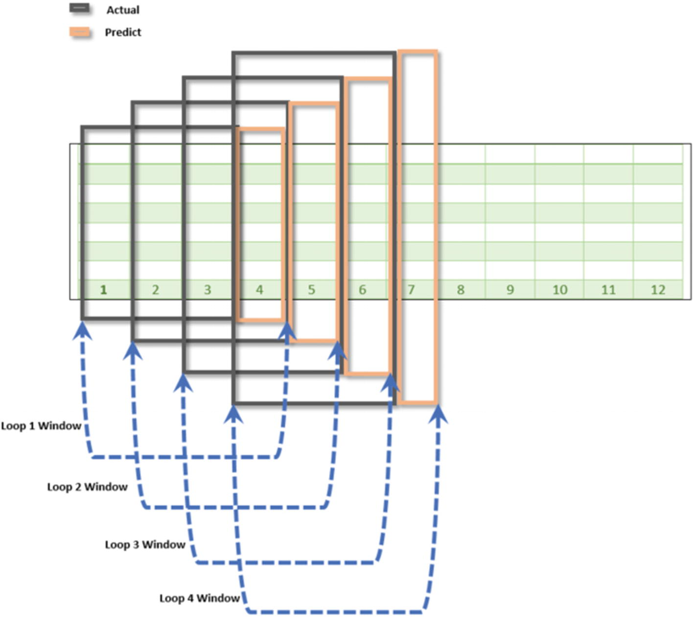

# Week 11 `Univariate Deep Learning`

This week we'll focus on using univariate deep learning techniques to do time series forecasting.

In the previous weeks, you learned about using traditional techniques to work with time-series data. In this week, you will learn how to solve univariate time-series problems using deep learning techniques. A univariate time series is a time series that consists of single (scalar) observations recorded sequentially over equally spaced time periods. In this week, you will look at single-step time-series forecasting and horizon-style time-series forecasting.

## Lesson Plan

* Read Vishwas Chapter 6: **Bleeding-Edge Techniques for Univariate Time Series**.
* [TimeSeriesGenerator](https://machinelearningmastery.com/how-to-use-the-timeseriesgenerator-for-time-series-forecasting-in-keras/): Additional read this blog post that explains Keras's `TimeSeriesGenerator`.  This concept of converting time series in standard format into one suitable for deep learning is perhaps the key concept necessary to successfully apply DL models to time series forecasting problems.  
* **[Additional Notebooks](./Chapter6)**: Execute some or all of the additional notebooks from Vishwas Chapter 6 in order to solidify your understand of various other types of DL architectures besides LSTMs

## Homework

[LSTM Univariate Forecasting](hw1-lstm.ipynb): Using our newly founded knowledge this week, let's apply Univariate LSTM model to a canonical airling passenger dataset 

## Solution

[Univariate LSTM](sol1-lstm.ipynb): Solution set

## Course Objectives Addressed

By learning to apply various univariate LSTM and other deep learning models, we've addressed the **7th Course Objective**: Build deep learning neural networks to forecast future values for time series