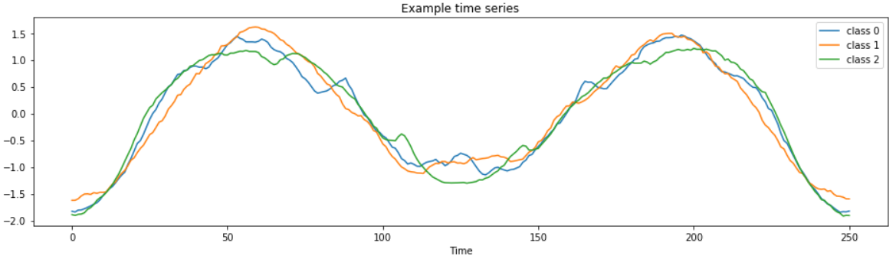

# Week 14

A common task for time series machine learning is classification. Given a set of time series with class labels, can we train a model to accurately predict the class of new time series?

There are many algorithms dedicated to time series classification! This means you don’t have wrangle your data into a scikit-learn classifier or to turn to deep learning to solve every time series classification task.

## Lesson Plan

Step through the following notebooks:
1. **[Deep Learning (DL) Classification](./les2-dl-classify.ipynb)**: This notebook from a very informative [Keras.io Tutorial](https://keras.io/examples/timeseries/timeseries_classification_from_scratch/) provides a great way to learn how to apply a DL model to detect issues in engines from motor sensors.
2. **[Sktime Methods](les1-sktime.ipynb)**: Step through this notebook to see some great examples of the various algorithms implemented in the great [sktime package](https://github.com/alan-turing-institute/sktime)
3. **[Sktime TS Representation](https://www.sktime.org/en/latest/examples/loading_data.html#)**: Read this good documentation on how sktime represents time series as you'll need it for this week's homework assignment

## Homework

[Classifier Comparison](hw1-compare.ipynb): This assignment asks you to apply various `sktime` classifiers to the engine issue problem we looked at within the DL tutorial.

## Solution

[Classifier Comparison](sol1-compare.ipynb): Solution set

## Course Objectives Addressed

By learning 2 key types of methods to classify time series, we've addressed the **10th Course Objective**: Classify time series using state of the art methods and preparation techniques.
